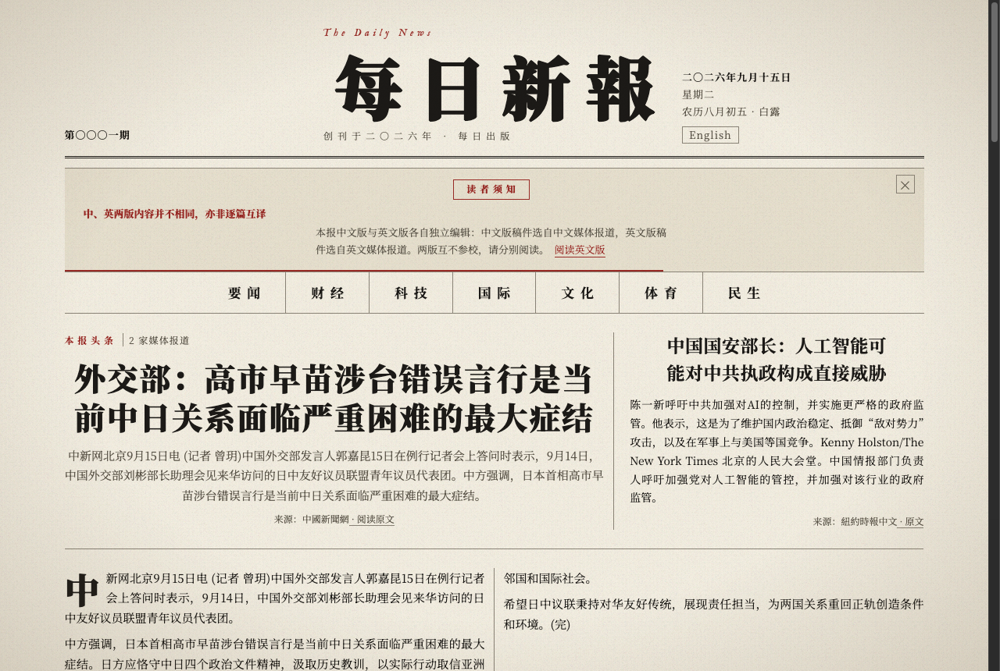

# 每日新報（DailyNews）

以报纸版式呈现当日新闻的静态站点，**中英双语**。每天清晨定时抓取 RSS 聚合、净化去噪、
打分选稿，生成一期「打开就是一张报纸」的静态页面——零脚本、零运行时依赖。



## 里程碑状态

- [x] M1 静态版式原型（11 项视觉验收）
- [x] M2 数据管道（RSS 抓取 → 清洗 → 去重 → 分类打分 → 选稿）
- [x] M3 Astro 渲染层（`/` 最新期、`/issue/[date]/`、`/archive/`）
- [x] M4 自动化（`.github/workflows/daily-issue.yml`，北京时间每日 06:00）
- [x] M5 打印样式（A4）、农历节气、OG 分享图、天气、LLM 标题改写（可选增强）
- [x] M6 **采集与选稿重建**：36 源 / 27 集团池、集团级配额、多源共识头条、摘要保真、
      头条正文与副刊落地、**中英双语版与语言切换**
- [x] M7 **动态排版 v5**：以宽度换高度、同行等高，**不再裁字**；真实浏览器守门脚本
- [x] M8 **出刊文案正式化**：广告位改「招租」口径、中英版差异显著声明（可关闭·全程零脚本）、
      英文版报头刊名镜像反转与字体设计、期号自第一期起算
- [x] 部署：GitHub Pages（https://tech--man.github.io/DailyNews/）

## 常用命令

```bash
pnpm install
pnpm test             # node --test 單元測試（95 用例）
pnpm run build:issue      # 抓取 RSS 生成 issues/<today>.json + meta + OG 圖
pnpm run build:issue:dry  # 只打印漏斗報表，不寫文件（調參用）
pnpm run diag:feeds       # 逐源探活：條數 / 時效 / 有摘要 / 耗時
pnpm run build:og         # 為全部期次重新生成 OG 圖
pnpm build            # Astro 構建到 dist/
pnpm preview          # 預覽構建產物
pnpm run verify:layout    # 真實瀏覽器守門：裁剪 / 溢出 / 對比度（需先 pnpm preview）
```

## 双语与语言切换

| 版本 | 路径 | 内容来源 | 界面语言 |
|------|------|----------|----------|
| 中文版 | `/`、`/issue/<date>/`、`/archive/` | `lang: zh` 的源 | 简体中文 |
| English | `/en/`、`/en/issue/<date>/`、`/en/archive/` | `lang: en` 的源 | English |

- **两个语言版各自独立选稿**，各有一份完整版面，互不冒充，也**不是互译关系**。
  这一点在报头下方以显著声明带告知读者：可手动关闭，5 秒后自动收起（带倒计时进度条）。
  为守住「零脚本」承诺，关闭与倒计时全部由 CSS 实现，未引入任何 JavaScript。
- 中文版对混入的繁体稿（如端传媒）自动过 opencc 转简体。
- 报头刊名「每日新報 / The Daily News」随版本**镜像排布**：
  中文版以中文刊名作大字（Noto Serif SC 900 · 88px · 大字距 · 双钩描边），拉丁刊名作小字；
  英文版反之，以 **Playfair Display 900 · 72px** 作大字，**中性字距、不描边**——
  中文那套字距与描边是为方块字等宽与细笔画补墨设计的，拉丁衬线照搬会「字间漏风」且描边糊衬线。
- 期号自**第一期起算**（按磁盘上的实际出刊序列，缺期不跳号），报头显示「第〇〇〇一期 / No. 1」。
- 跨语言互译（把 A 版的头部稿件译入 B 版）是**可选增强**，需配置 LLM 金钥；
  未配置时自动跳过，页面上不出现「域外译讯」栏。

## 配置

- `config/feeds.json` — 源池与版面配额。每个源声明：
  - `group` **媒体集团**（配额按集团计算，防止一家媒体开多频道绕过多样性约束）
  - `tier` `core` / `standard` / `optional`（仅 core 可出头条/次条）
  - `lang` `zh` / `en`
  - `category` 语言中立的类目键（`top`/`world`/`business`/`tech`/`culture`/`sport`/`society`/`science`）
- `config/feeds.json` 的 `layout.<lang>` — 每语言版的版面配额（头条门槛、各版条数、简讯上下限、副刊规则）
- `scripts/og.mjs` — OG 卡片字体缓存目录可用 `OG_FONT_DIR` 覆盖（默认 `.og-fonts/`，不入库）

### 版面选择规则

```
頭條  1 篇   tier=core → 類目優先 → 多源共識 ≥2 家 → 導語充足（逐級放寬，並回報選稿檔位）
次條  1 篇   與頭條不同集團，優先硬新聞類目
各版  要聞2 財經3 科技3 國際3 文化2 體育2 民生2   有貨才出；同版不同集團，不足時放行同集團補位
簡訊  8–16 條  按集團輪轉取稿，單類目上限 5 條
副刊  1 篇   文化/科學長文優先，無則取全池最長摘要（保證版面不空）
約束  單集團占全期 ≤20%
```

**多源共识**：把标题按字符 bigram 聚类，同一事件被越多**独立媒体集团**报道，共識度越高
（上限 5）。这是头条权威性的主要信号——它让「5 家独立媒体报道」的事件自动压过单一来源的高分稿。

### LLM 增强（可选）

不配置则自动跳过、保留 RSS 原标题。金钥仅从环境变量读取：

```bash
export LLM_API_KEY=***    # 必填才启用
export LLM_BASE_URL=https://open.bigmodel.cn/api/paas/v4   # 可选，OpenAI 兼容接口
export LLM_MODEL=glm-4-flash                                # 可选
```

两项增强：**中文标题改写**（8–12 字报纸体，禁感叹问号，不合格回退原题）、
**跨语言翻译**（生成「域外译讯」栏，单条不合格则跳过而非冒充译文）。

## 部署（GitHub Pages）

- 站点地址：https://tech--man.github.io/DailyNews/
- 推送 `main` 即自动测试、构建并部署（`.github/workflows/deploy.yml`）
- 每日定时出刊提交新期后主动 `workflow_dispatch` 上述部署工作流
  （定时任务用 GITHUB_TOKEN 推送不会触发 push 事件，须显式触发）
- 项目页挂在 `/DailyNews/` 子路径：`astro.config.mjs` 的 `base` 已配置，
  站内链接统一走 `src/lib/base.mjs` 的 BASE 前缀（`langPrefix()` 负责追加 `en/`）
- 定时出刊在 GitHub Actions 上默认无 `LLM_API_KEY`，改写与翻译自动跳过；
  如需线上启用，在仓库 Secrets 添加同名变量即可

## 版权约束

只存标题、截断摘要与原文链接，不存全文；原文版权归各来源所有。

## 结构

```
config/feeds.json        源池（集团/tier/语言/类目）与版面配额
issues/                  每日期数据（入 Git）；<date>.meta.json 为出刊元数据
scripts/lib.mjs          纯函数：清洗/摘要/去重/分类/共识/打分/配额选稿/加工
scripts/feed.mjs         抓取与解析（SSRF 防护、重试、RSS2.0+Atom 统一）
scripts/generate-issue.mjs  出刊编排：抓取 → 规范 → 双语言版选稿 → meta + OG
scripts/rewrite.mjs      LLM 标题改写与跨语言翻译（可选，失败即降级）
scripts/og.mjs           OG 分享图（satori + sharp），每语言一张
scripts/diag-feeds.mjs   源探活诊断
scripts/verify-layout.mjs 排版守门：真实浏览器断言（裁剪/溢出/对比度）
scripts/vendor-fonts.sh  自托管字体子集拷贝（@fontsource → public/fonts）
src/lib/i18n.mjs         UI 文案词典（zh / en）
src/lib/dateCn.mjs       日期格式化的中英两套
src/lib/issues.mjs       期数据读取 + 期号派生（自最早期次起算）
src/lib/fit.mjs          構建時排版測量（求解欄寬比例，注入 CSS 變量）
src/lib/tidy.mjs         見報文本潔淨（標點空格清洗）
src/components/          版面组件（FrontPage 装整张报，中英共用；EditionNotice 为差异声明带）
src/pages/               中文版页面 + en/ 英文版页面
public/css/newspaper.css 全部样式（设计令牌 + 容器查询 + 打印）
public/fonts/            自托管字体子集（Noto Serif SC / Playfair / Old Standard / IM Fell）
tests/                   node:test 单元测试
docs/                    规划存档、实施记录、验收截图
```

## 排版系统（v5：以宽度换高度）

目标：**不管内容如何，版面始终成立**，且**不裁字**。三层机制：

1. **令牌**：字號 9 檔 / 行高 3 檔 / 間距 4px 基 / 線系 4 級（雙線隔大區、墨線封欄目、
   灰線分區、點線斷列表），全部 rem（打印縮 `html` 字號即整報縮放）。
   版面常量以 `newspaper.css :root` 為唯一事實來源，`fit.mjs` 與之對拍（單測守衛）。
2. **構建時求解欄寬比例**：`fit.mjs` 按內含量求解比例，注入 `--head-cols`（頭條／次條）、
   `--row-cols`（同排版塊）、`--pair-cols`（版塊內並肩兩篇），使**同一視覺行內各項等高**；
   正文欄數與行寬另經 `--cols` / `--measure` 注入。
   v5 之前是估算行數後用 `max-height` + 尾部漸隱裁字——代價是讀者拿到殘句
   （實測最多丟 9 行），現已**整體移除**：一律應顯盡顯。
3. **閉合**：同行等高由 grid stretch + 來源行 `margin-top: auto` 釘底保證，頭版
   各區豎線全閉合，簡訊 >9 條轉雙列密排，高度差由框線合法化。

響應式按**容器寬**三檔：版心 **≥1100**（寬版，頭版雙列、版塊並排）、
**600–1099**（中幅，頭版與版塊轉單列；≤759 時報頭亦折為單列）、
**≤599**（窄幅，正文強制單欄）。打印 A4（版心 ≈703px）自動落入中幅。
英文版標題 Playfair Display、正文 Old Standard TT（CJK 字體的彎引號是全角字形，
英文所有格必須走 Latin 字族）；渲染前所有見報文本經 `tidy` 清洗。

## 设计文档

- `docs/dev-plan.md` — 用户提供的原始规划（项目总纲）
- `docs/plans/2026-09-15-采集与选稿重建方案.md` — 首刊内容缺失的根因诊断与重建方案
- `docs/plans/2026-09-15-自动排版适配方案探讨.md` — 自动排版的诊断与方案
- `docs/typography-optimization/HANDOFF.md` — 排版优化变更台账（逐条对照 + 回退方式）
- `docs/typography-optimization/CHECKS.md` — 优化前后的验证记录与指标
- `docs/screenshots/` — 各里程碑验收截图
